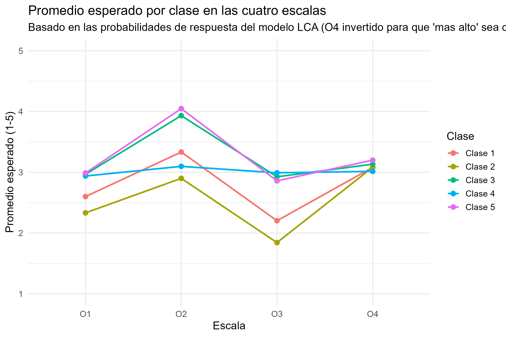

# 1. Problematización {background-color="#2c3e50"}

## ¿Por qué estudiar el consumo político hoy?

- Las formas tradicionales de participación (voto, militancia partidaria) muestran señales de declive
- Emergen repertorios de acción **individualizados y no institucionalizados**
- El consumo político se consolida como una de las prácticas más extendidas, en ciertos contextos la forma de participación por excelencia [@copeland_conceptualizing_2013]
- El acto de compra se valida como ejercicio de poder transformador, análogo al sufragio (ariztia, 2009) <!-- VERIFICAR: esta clave no existe en akatu.bib; falta agregar la referencia de Ariztia (2009) -->

## El problema teorico: ¿un concepto o varios?

- La literatura reconoce una **"confusión terminológica"** en el uso de estos conceptos [@yoshizatobierwagen_ideologizacao_2016; @silva_cultura_; @santos_atitudes_2022a]
- Múltiples etiquetas conviven para fenómenos parcialmente distintos:
  - consumo consciente
  - consumo sustentable
  - consumo responsable
  - consumo ético / verde
- Riesgo: sumar comportamientos de lógica distinta en un mismo índice diluye matices normativos relevantes [@copeland_conceptualizing_2013]

## ¿Por qué es relevante resolver esta confusión?

::: {.incremental}
- **Medición:** instrumentos que combinan actos de deber (boicot) y de compromiso (buycott) pueden estar midiendo constructos distintos [@copeland_conceptualizing_2013]
- **Teoría:** sin distinción conceptual no se explica por qué ciertos rasgos psicológicos predicen un acto y no otro [@ackermann_psychological_2020]
- **Evidencia empírica:** no sabemos si "consumidor consciente" es una identidad única o una etiqueta que agrupa perfiles distintos → pregunta que responde el análisis de clases latentes
:::

# 2. Marco conceptual y definiciones {background-color="#2c3e50"}

## Boicot vs. Buycott

- **Boicot**: orientado al castigo; se vincula a normas de ciudadanía del deber, cercanas a la política tradicional de intereses [@copeland_conceptualizing_2013]
- **Buycott**: orientado a la recompensa; refleja normas de ciudadanía comprometida y soluciones colectivas vía redes informales [@copeland_conceptualizing_2013]
- La **apertura a la experiencia** predice ambos actos; la **amabilidad** inhibe el boicot pero no el buycott [@ackermann_psychological_2020]
- La **escrupulosidad** inhibe el consumo político en general, en favor de vías institucionales percibidas como "deber cívico" [@ackermann_psychological_2020]

## Consumo consciente

> El consumidor deja de ser espectador para volverse un participante activo que busca soluciones sostenibles

- Implica analizar impactos personales, sociales, económicos y ambientales de cada elección de compra [@instututoakatu._pesquisa_] <!-- clave actualizada desde @akatu_pesquisa_2006: la entrada del bib es el techreport "Pesquisa 2006-2007" del Instituto Akatu, sin campo year explícito; confirmar que es el informe correcto -->
- Se define primordialmente por actitudes y comportamientos de carácter **individual** [@silva_cultura_; @akatu_pesquisa_2007b]
- Acto de movilización para "construir un mundo mejor" a través del poder de elección [@yoshizatobierwagen_ideologizacao_2016; @silva_cultura_]

## Consumo sustentable

- Satisface las necesidades del presente sin comprometer a las generaciones futuras [@ham_what_2018] <!-- VERIFICAR: esta clave no existe en akatu.bib; falta agregar la referencia -->
- A diferencia del consumo consciente, se posiciona como un fenómeno **colectivo y político**, resultado de la interrelación ciudadanos–empresas–gobierno [@silva_cultura_; @portilho_consumo_2005]
- Vinculado a la idea de **"corresponsabilidad"** frente a la decisión de compra [@acunamoraga_sustentabilidad_2018]

## Consumo responsable

- El consumidor pondera las **consecuencias públicas** de decisiones privadas [@websterjr._determining_1975]
- En Chile, se fragmenta en tipologías desde el "indiferente" al "consciente" (Encuesta Nacional UDP) (ariztia, 2009) <!-- VERIFICAR: esta clave no existe en akatu.bib; falta agregar la referencia de Ariztia (2009) -->
- Intenciones de compra guiadas por preocupaciones sociales y ambientales, usando el poder de mercado para incentivar prácticas corporativas éticas [@han_explaining_2016; @boccia_impact_2017]

## Consumo ético y consumidor verde

- **Consumo ético**: evalúa si los estándares de producción cumplen criterios morales, tensionado por "excusas baratas" o licencias morales [@engel_little_2020]
- **Consumidor verde**: comportamiento de compra explicado por conocimiento ambiental, afecto ambiental y preocupación ecológica [@larios-gomez_nota_2019] <!-- VERIFICAR: en akatu.bib la entrada de Larios-Gómez está fechada 2019, no 2018; confirmar que corresponde al mismo trabajo -->

## Un modelo integrador: la jerarquización de Silva

- Verde → consciente → sustentable, como **niveles acumulativos** de complejidad
- De lo técnico-ambiental del producto, a lo individual (satisfacción + impacto), a lo político-colectivo
- El consumo sustentable no reemplaza a los otros niveles: los **engloba**
- Implicancia directa para el diseño empírico: si los niveles son acumulativos, deberían observarse como perfiles jerárquicos, no solo como categorías paralelas

# 3. Vacío y pregunta de investigación {background-color="#2c3e50"}

## Lo que no sabemos todavía

- Los instrumentos existentes (Akatu, UDP, escalas de conocimiento ecológico) suelen **asumir a priori** cuántos "tipos" de consumidor existen
- Pocos estudios dejan que los datos revelen los perfiles de manera inductiva
- **Pregunta de investigación:** ¿la estructura empírica de las prácticas de consumo coincide con las categorías teóricas propuestas (consciente / sustentable / responsable / ético)?

# 4. Estrategia metodológica {background-color="#2c3e50"}

## ¿Por qué Análisis de Clases Latentes?

- Técnica centrada en la **persona**, no en la variable: identifica subgrupos no observados según patrones de respuesta
- Permite **testear empíricamente** si las categorías teóricas se sostienen en los datos, en vez de imponerlas
- Parte de una variable latente **categórica**, no continua, que subyace a las asociaciones entre ítems observados

## Diseño del instrumento

- Batería de **45 ítems** tipo Likert sobre prácticas y actitudes de consumo
- Cuatro escalas:
  - **O1** — consumo global / digital
  - **O2** — hábitos cotidianos
  - **O3** — activismo / consumo ético
  - **O4** — actitudes hacia el reciclaje
- Estrategia mixta: LCA (`poLCA`) sobre ítems ordinales.

## Selección del modelo y calidad de clasificación

- Comparación de soluciones de 1 a 6 clases (AIC, BIC, log-verosimilitud)
- Cálculo de **entropía** y **matriz de error de clasificación** (diagonal alta = buena clasificación)
- En el modelo preliminar: entropía > 0.8 y diagonal de la matriz ≥ 0.93 → clasificación confiable

## Cruce con covariables: enfoque de tres pasos

- Evita el sesgo de estimar clases y relación con covariables **simultáneamente**
- **Paso 1:** estimar el modelo de medición (LCA)
- **Paso 2:** estimar la matriz de error de clasificación
- **Paso 3:** relacionar clases con covariables sociodemográficas (edad, NSE, zona, educación, ingreso) corrigiendo por la incertidumbre de clasificación
- Métodos aplicados: pseudo-clases con reglas de Rubin [@wang_pseudoclass_2005; @vermunt_2010] <!-- VERIFICAR: ninguna de las dos claves existe en akatu.bib; faltan agregar ambas referencias --> y ML de 3 pasos vía EM, como prueba de robustez cruzada

# 5. Hallazgos preliminares {background-color="#2c3e50"}

## Cinco perfiles de consumidor

::: {style="font-size: 0.7em;"}
| Clase | Tamaño | Perfil | Nombre sugerido |
|---|---|---|---|
| 1 | 34.9% | Nivel bajo-medio en casi todo, sin rasgos extremos | Consumidores convencionales |
| 2 | 17.7% | El más bajo en las 4 dimensiones | Desconectados / pasivos |
| 3 | 19.4% | Alto en hábitos cotidianos y compra "verde" individual | Verdes individuales |
| 4 | 6.7% | Único con activismo colectivo alto; escéptico del reciclaje individual | Críticos / activistas |
| 5 | 21.3% | El más alto y consistente en hábitos + actitudes de reciclaje | Responsables ejemplares |
:::

---

## Perfiles de clase — visualización

{fig-align="center" width="80%"}

---

## Posibles hallazgos

- El **activismo colectivo** (bloque O3: asociaciones, Sernac, marchas) está prácticamente **desacoplado** de los hábitos y actitudes cotidianas (O2/O4)
- Solo la clase más pequeña (7%) combina ambas dimensiones.
- Las clases con mejores hábitos diarios (3 y 5, 41% de la muestra) casi no participan en acción colectiva
- Este patrón conecta directamente con la distinción teórica boicot/buycott y con la idea de ciudadanía comprometida individual vs. colectiva [@copeland_conceptualizing_2013]

# 6. Contribución esperada {background-color="#2c3e50"}

## Posibles aportes de la propuesta

- Evidencia empírica para una parte de la "confusión terminológica": las categorías teóricas **no son mutuamente excluyentes** en la práctica de los individuos
- Aporte local: aplicación de LCA, poco frecuente en estudios de consumo político
- Integra indicadores de diferentes constructos en un solo marco empírico,posible dialogo con Copeland y Ackermann.

## Próximos pasos

- Profundizar la literatura metodológica clásica de LCA: [@lazarsfeld_henry_1968; @collins_lanza_2010; @nylundgibson_choi_2018] <!-- VERIFICAR: ninguna de las tres claves existe en akatu.bib; faltan agregar las tres referencias -->
- Nombrar y validar teóricamente los cinco perfiles a la luz de la jerarquización de Silva
- Cruzar los perfiles con variables sociodemograficas (hecho)

## Referencias

::: {#refs}
:::
